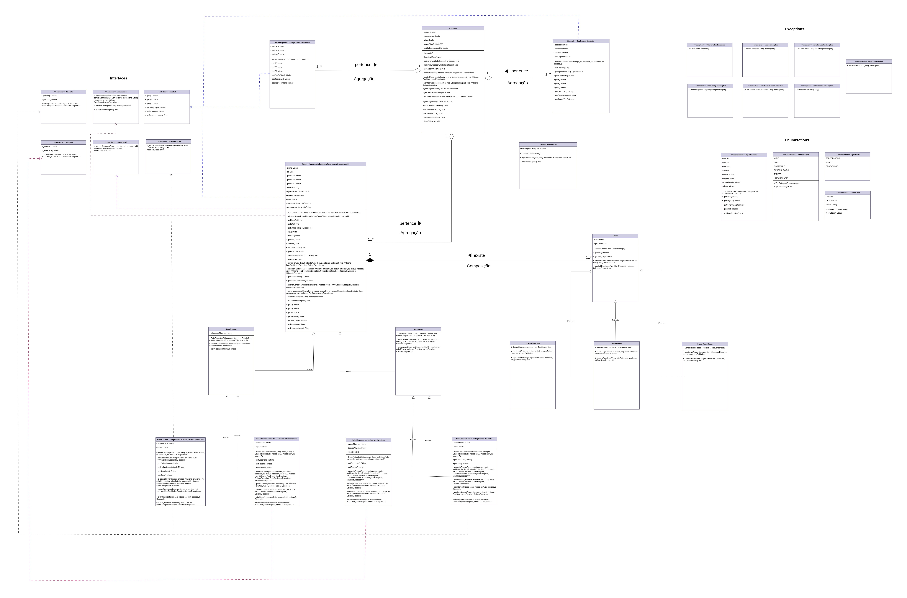

### Nomes e RAs:
Priscilla Almeida (176205)
Ana Luiza Mota Gomes (242389)

### Descrição do repositório:
Este é o repositório do projeto da disciplina de MC322. 
O projeto está organizado em diferentes laboratórios (labs), cada um representa uma etapa de seu desenvolvimento.
Há também uma pasta images que contém o Diagrama de Classes.

### Principais mudanças no Lab04
Neste laboratório, foram implementadas interfaces, que adicionaram novos comportamentos aos robôs, e realizado o tratamento de exceções, que antes estava sendo feito manualmente. 
Além disso, o mapa foi atualizado, passando a ser uma matriz também capaz de registrar quais entidades ocupam cada espaço do ambiente. 
O menu interativo também foi alterado, pois antes o usuário selecionava a ação e em seguida o robô que a faria, agora, o menu está mais focado nos robôs, o usuário seleciona um robô e em seguida visualiza tudo o que aquele robô é capaz de fazer.

### Lista de interfaces:
- Atacante (implementada pelas classes Robô Obstáculo Aéreo e Robô Cavador);
- Comunicavel (implementada pela classe Robo);
- Curador (implementada pelas classes Robô Flutuador e Robô Obstáculo Terrestre);
- DestroiObstaculo (implementada pela classe Robô Cavador);
- Entidade (implementada pelas classes Robô, Obstáculo e Tapete Reposição);
- Sensoreavel (implementada pela classe Robô);
  
### Lista de exceções:
- ColisãoException (exceção lançada na classe Ambiente);
- ErroComunicacaoException (exceção lançada na classe Robô);
- ForaDosLimitesException (exceção lançada na classe Ambiente)
- RoboDesligadoException (exceção lançada na classe Robô);
- ValorInvalidoException (exceção lançada na Main);
- VelocidadeMaxException (exceção lançada na classe Robo Terrestre);
- VidaNulaException (exceção lançada nas classes Robô)

### Informações sobre IDE e Java:
IDE utilizada: VScode
Versão do Java utilizada: 21.0.5

### Execução:
Para executar o programa siga os seguintes passos:
- Entre na pasta do projeto e depois na pasta do laboratório desejado.
  Exemplo:
  ``` bash
  cd MC322/lab04
- Para compilar o programa utilize o comando no terminal:
  ``` bash
  javac Main.java

- Para rodar utilize o comando no terminal:
  ``` bash
  java Main.java

### Diagrama de classes:

