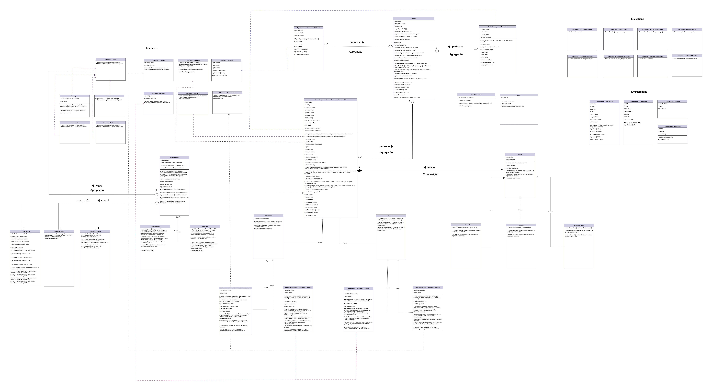

### Nomes e RAs:
Priscilla Almeida (176205)
Ana Luiza Mota Gomes (242389)

### Descrição do repositório:
Este é o repositório do projeto da disciplina de MC322. 
O projeto está organizado em diferentes laboratórios (labs), cada um representa uma etapa de seu desenvolvimento.
Há também uma pasta images que contém o Diagrama de Classes.

### Principais mudanças no Lab05
Neste laboratório, foi implementada a interface Missão e as classes AgenteInteligente, AgenteSegurança e AgenteVida:
- Interface Missão: Define métodos obrigatórios da Classe MissãoSegurança, MissãoBuscarPonto (especificas do AgenteSegurança), MissãoReviver e MissãoContactarCuradores (especificas do AgenteVida) 
- AgenteSegurança: capaz de proteger Robôs que estão dentro do raio, impedindo que eles sejam atacados por Robôs Atacantes (se estiver realizando a missãoSegurança). Ele também é capaz do buscar um ponto desejado pelo usuário (se estiver realizando a missãoBuscarPonto) .
- AgenteVida: capaz de reviver robôs que estão mortos, pois Robôs curadores não conseguem reviver outros robôs apenas aumentam a quantidade de vidas dos que estão vivos (se estiver realizando a missãoReviver). Ele também é capaz de contactar Curadores que estiverem próximos a um Robô com pouca vida (se estiver realizando a missãoContactarCuradores).
O funcionamento dos agentes também foi modularizado de acordo com os subsistemas passados por agregação: ControleMovimento, GerenciadorSensores e ModuloComunicacao.

### Lista de interfaces atualizada:
- Atacante (implementada pelas classes Robô Obstáculo Aéreo e Robô Cavador);
- Comunicavel (implementada pela classe Robo);
- Curador (implementada pelas classes Robô Flutuador e Robô Obstáculo Terrestre);
- DestroiObstaculo (implementada pela classe Robô Cavador);
- Entidade (implementada pelas classes Robô, Obstáculo e Tapete Reposição);
- Sensoreavel (implementada pela classe Robô);
- Missao (implementada pelas classes Missão Vida e Missão Segurança)
  
### Lista de exceções atualizada:
- ColisãoException (exceção lançada na classe Ambiente);
- ErroComunicacaoException (exceção lançada na classe Robô);
- ForaDosLimitesException (exceção lançada na classe Ambiente)
- RoboDesligadoException (exceção lançada na classe Robô);
- ValorInvalidoException (exceção lançada na Main);
- VelocidadeMaxException (exceção lançada na classe Robo Terrestre);
- VidaNulaException (exceção lançada nas classes Robô)
- AreaProtegidaException (exceção lançada na classes que implementam a interface Atacante)

### Informações sobre IDE e Java:
IDE utilizada: VScode
Versão do Java utilizada: 21.0.5

### Execução:
Para executar o programa siga os seguintes passos:
- Entre na pasta do projeto e depois na pasta do laboratório desejado.
  Exemplo:
  ``` bash
  cd MC322/lab05
  
- Para compilar o programa utilize o comando no terminal (linux):
  ``` bash
  javac -d bin src/*/*.java

  No Windows é possível que não funcione dessa maneira, alternativamente utilizar:
  javac -d bin src\ambiente\*.java src\arquivos\*.java src\comunicacao\*.java src\enums\*.java src\exceptions\*.java src\interfaces\*.java src\main\*.java src\missao\*.java src\obstaculos_tapetes\*.java src\robo\*.java src\sensores\*.java src\subsistemas\*.java


- Para rodar utilize o comando no terminal:
  ``` bash
  java -cp bin main.Main

### Diagrama de classes:

